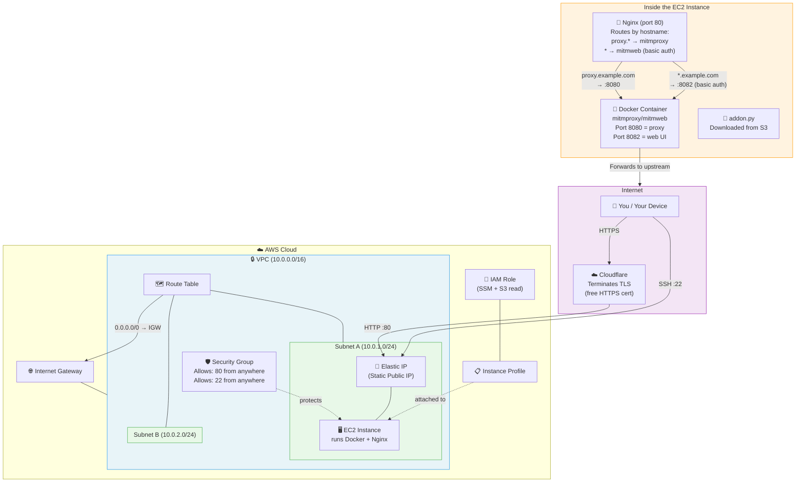

# Architecture

## How it works

1. **Cloudflare** terminates TLS — you get a valid HTTPS cert without ACM or an ALB.
2. **Elastic IP** gives the EC2 a fixed public address. Point Cloudflare DNS (proxied) at it.
3. **Nginx (port 80)** routes by hostname:
   - `proxy.example.com` → mitmproxy on port 8080 (the actual intercepting proxy)
   - Everything else → mitmweb UI on port 8082 (with basic auth)
4. **Docker** runs mitmweb which provides both the proxy (8080) and web UI (8081, mapped to 8082 on host).
5. **Security Group** only exposes port 80 (HTTP from Cloudflare) and port 22 (SSH).
6. **IAM Role** lets the EC2 fetch credentials from SSM and the addon script from S3.
