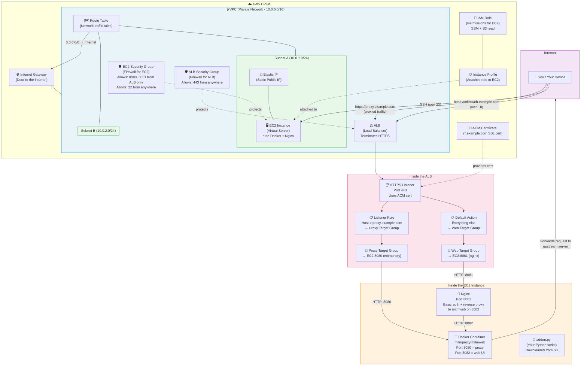

# Architecture

## How it works (in plain English)

1. **VPC** = Your own private network in AWS. Nothing gets in or out unless you allow it.
2. **Subnets** = Smaller sections of the VPC. The ALB needs at least 2 in different zones (for redundancy).
3. **Internet Gateway** = The "door" connecting your VPC to the public internet.
4. **Route Table** = Rules that say "traffic going to the internet → use the Internet Gateway".
5. **ALB (Load Balancer)** = The front door for HTTPS traffic. It holds the SSL certificate and decides where to send requests based on the domain name.
6. **HTTPS Listener** = Listens on port 443, uses the ACM certificate.
7. **Listener Rule** = If the request is for `proxy.example.com` → send to mitmproxy. Otherwise → send to mitmweb (nginx).
8. **Target Groups** = "Address books" telling the ALB which port on the EC2 to forward to.
9. **Security Groups** = Firewalls. The ALB allows port 443 from anywhere. The EC2 only allows traffic from the ALB (except SSH).
10. **EC2 Instance** = The virtual server running everything.
11. **Elastic IP** = A fixed public IP so SSH always works at the same address.
12. **IAM Role + Profile** = Permissions allowing the EC2 to download your addon script from S3.
13. **Nginx** = Adds username/password protection in front of the mitmweb UI.
14. **mitmproxy (Docker)** = The actual proxy that intercepts and displays traffic, running your `addon.py` script.
